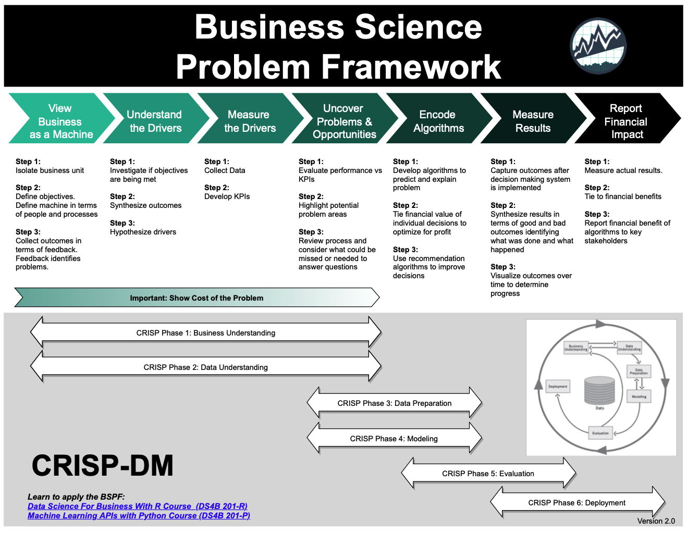
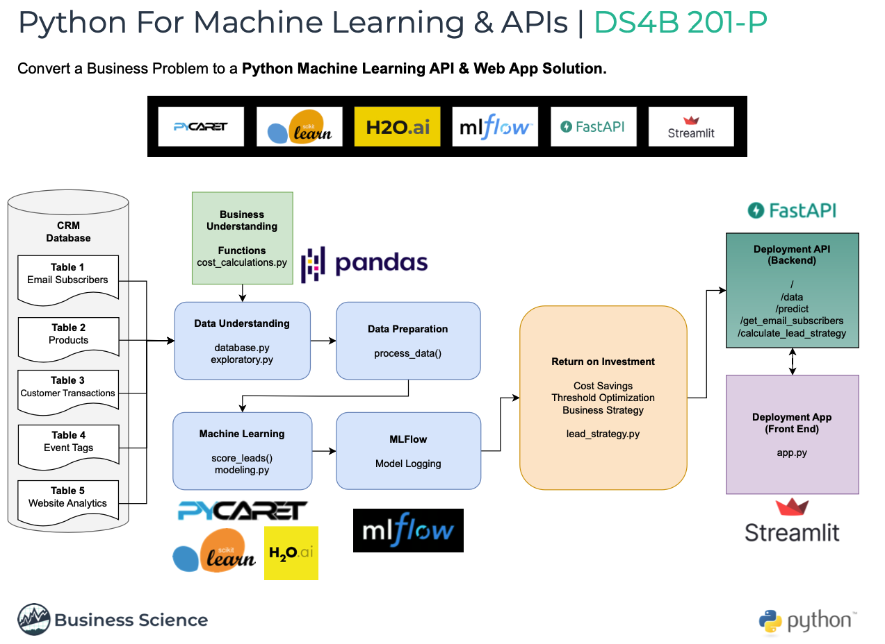
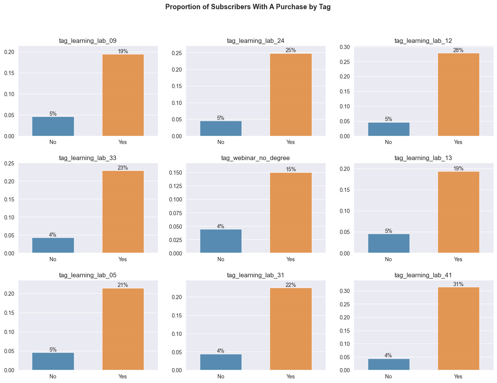
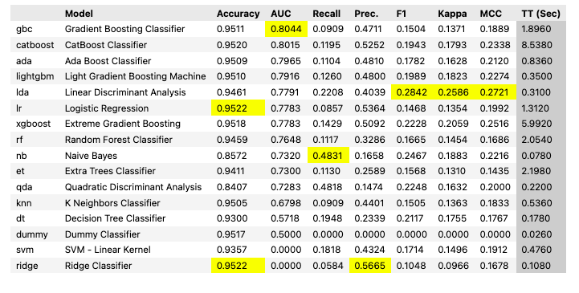
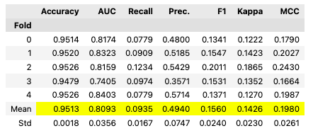
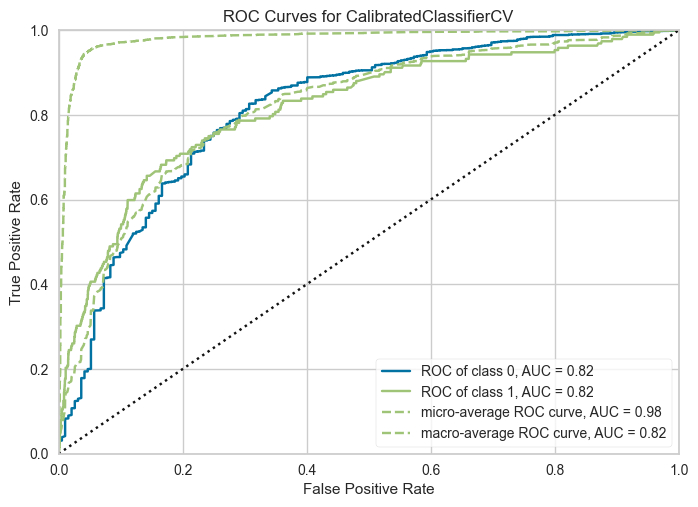
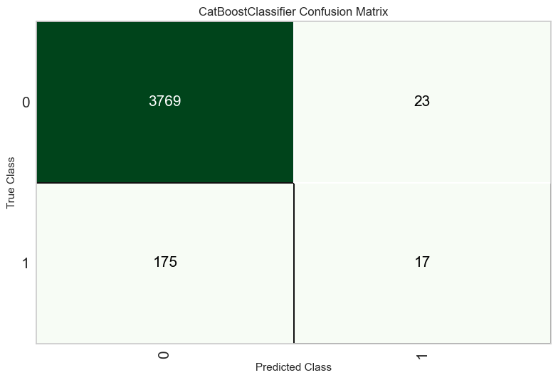
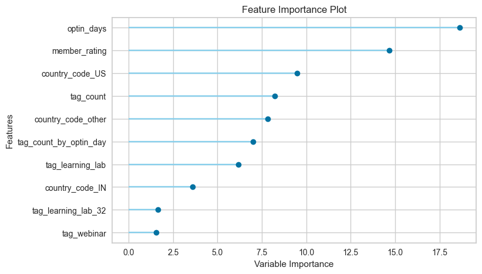
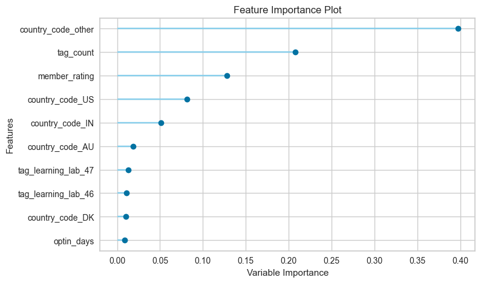
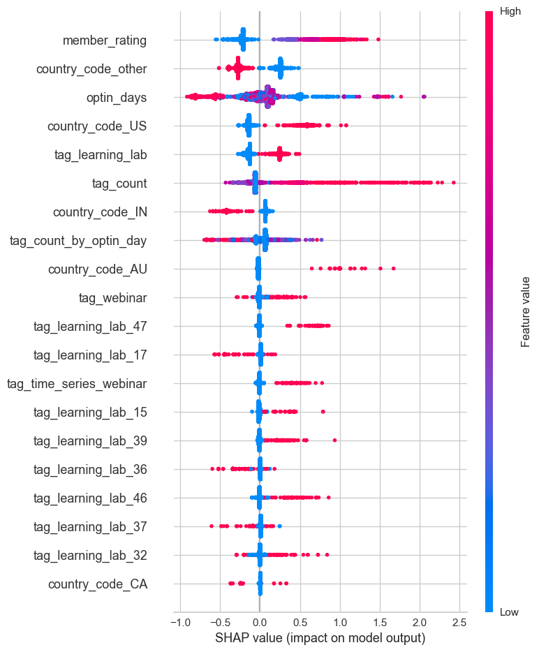

<!-- omit in toc -->

    <h1>Unleashing the Power of Machine Learning for Email Lead Scoring</h1>
    <h2>A Case Study & Guided Project Using the Business Science Problem Framework</h1>
    <h4>Lucas Okwudishu - June 2023</h1>

---

     
    
     

---

     
    
     

---

<!-- omit in toc -->
## **Table of Contents**

- [**1.0 Introduction**](#10-introduction)
- [**2.0 Problem Statement \& Objective**](#20-problem-statement--objective)
- 
  - [**2.1 Problem Statement**](#21-problem-statement)
  - [**2.2 Objective**](#22-objective)
- [**3.0 Business Understanding**](#30-business-understanding)
- 
  - [**3.1 Cost Assessment**](#31-cost-assessment)
- [**4.0 Data Understanding**](#40-data-understanding)
- 
  - [**4.1 Exploratory Data Analysis**](#41-exploratory-data-analysis)
    - [**4.1.1 Proportion of Users with a Previous Purchase**](#411-proportion-of-users-with-a-previous-purchase)
    - [**4.1.2 Member Rating vs Made Purchase**](#412-member-rating-vs-made-purchase)
    - [**4.1.3 Country Code vs Made Purchase**](#413-country-code-vs-made-purchase)
    - [**4.1.4 Tag Count vs Made Purchase**](#414-tag-count-vs-made-purchase)
    - [**1.4.5 Correlation**](#145-correlation)
- [**5.0 Formulating KPIs**](#50-formulating-kpis)
- 
- [**6.0 Feature Engineering**](#60-feature-engineering)
- 
- [**7.0 Modeling**](#70-modeling)
  - [**7.1 Testing Multiple Models**](#71-testing-multiple-models)
  - [**7.2 Model Blending for Enhanced Performance**](#72-model-blending-for-enhanced-performance)
  - [**7.3 Model Metrics**](#73-model-metrics)
    - [**7.3.1 AUC-ROC Plot**](#731-auc-roc-plot)
    - [**7.3.2 Confusion Matrix**](#732-confusion-matrix)
    - [**7.3.2 Feature Importance**](#732-feature-importance)
    - [**7.3.2 Shap Values**](#732-shap-values)

## **1.0 Introduction**

Businesses face challenges in identifying and prioritizing potential customers and/or identifying future purchase potential of current customers based on their email interactions, leading to suboptimal allocation of resourcesa nd missed opportunities.

Email lead scoring plays a crucial role in determining the quality and conversion potential of leads generated through email marketing campaigns. Email lead scoring is a method
used by marketers and sales teams to evaluate and prioritize leads based on their potential to become customers. It involves assigning scores or ratings to individual leads
based on their behaviour, interations, and other characteristics. However, the traditional manual lead scoring methods are time-consuming, subjective, and often produce inconsistent results. Additionally, these methods do not fully leverage the available data, such as email content, sender information, and historical customer interactions.

Machine learning-based solution that can effectively evaluate the probability of leads converting into customers based on various data points extracted from email interactions. This solution should take into account factors like email open rates, click-through rates, response times, engagement patterns, and historical customer data to provide a comprehensive lead score.

By leveraging machine learning algorithms, such as classification models or predictive analytics techniques, businesses can create a reliable and automated system that can accurately score and rank email leads according to their conversion potential. The solution will empower email marketers to prioritize their efforts and resources more effectively, enabling them to focus on the most promising leads and improve overall sales and marketing efficiency.

This analysis works through and end-to-end email lead scoring solution for a business, from analysis to deployment. Skills demonstrated in this project include -

- Project management.
- Stakeholder management.
- Business understanding.
- Business return on investment and sensitivity analysis.
- Exploratory data analysis.
- Machine learning (using tools like python, pycaret, mlflow).
- Model deploying (using tools like fastapi and streamlit).

Above all, the project demonstrates how to solve key business problems in the real world.

## **2.0 Problem Statement & Objective**

<blockquote style="border: 2px solid #2c3e50;
padding: 10px; background-color: #2c3e50; color: white">
BSPF Phase: Business Understanding | View Business As A Machine.
</blockquote>
---

---

### **2.1 Problem Statement**

As mentioned earlier, this analysis provides a lead scoring solution for a company (Business Science University). The company offers training cources (the **product**) in data science and has a large email list of **100,000** subscribers, with a monthly growth rate of **6,000** new subscribers. The marketing team also sends out **5** emails per month and the business's scales cycle generates approximately **$550,000** in revenue per month.

However, the email list also experiences a significant number of unsubscribes, about **500** per email, resulting in a total of **2,500** unsubscribers per month.

This High unsubscribe rate indicates potential inefficiencies in the email marketing strategy. In addition, high unsubscribe rates can result in reduced revenue especially if the business relies heavily on email marketing as a primary channel for generating leads and driving conversions. To sustain and increase revenue, it is crucial to optimize the email marketing approach and maximize customer conversion rates. The business also believes that nurturing lost customers has the potential to convert approximately 5% of them back into active customers.

---

### **2.2 Objective**

Given these key insights, the problem at hand is to develop an effective email list scoring and segmentation strategy. The goal is to identify and prioritize the most valuable customers while reducing unsubscribe rates and increasing overall customer conversions. By segmenting the email list based on various factors and implementing tailored communication and nurturing strategies, the business aims to optimize the use of marketing resources and enhance revenue generation.

In summary, the primary objective is to leverage email list scoring and segmentation techniques to improve customer engagement, reduce unsubscribes, increase customer conversion rates, and ultimately maximize revenue and customer lifetime value.

Now that we have a general understanding of the problem statement and the objective, the next sections
will focus on a business solution process using the BSPF.

---

## **3.0 Business Understanding**

<blockquote style="border: 2px solid #2c3e50;
padding: 10px; background-color: #2c3e50; color: white">
BSPF Phase: Business Understanding | Understanding/Measuring The Drivers.
</blockquote>
---

 

We know that tackling business problems such as this requrires alot of resources including
time and money. Therefore a key question to ask is **is this problem worth solving?.**

In this phase, the key is to analyze if solving this problem should be a business prority. One way to achive this is by calculating the cost of the business problem by understand how high unsubscribe rates lead to lower revenue. Our goals in this phase include:

- Cost Assessment - Assign a cost to high unsubscribe rates, thus giving the business a point estimate of annual costs of unsubscribe rates. This step does NOT account of growth rate of email lists.
- Improve Cost Analysis - Improve on cost assesment by account for email list growth uncertainty.
- Business Cost Simulation - This is also necessary when accounting for uncertainty and helps model cost when key inputs change.

---

### **3.1 Cost Assessment**

Given the values highlighted in the problem statement section, we can estimate the monthly lost revenue (we'll refer to this as **cost** going forward) due to unsubscribers to be around $250K per month (or $3M annually), not factoring in email list growth rate. After factoring in a 3.5% monthly email list growth rate, we can expect the annual lost revenue due to unsubscribers to rise to around $364K per month (or $4.3M per year), an increase of 46% in lost revenue. The table below shows this scenario.

     
    
     

We can see the high cost of this problem which is the lost revenue to the business. However, the
values shown in the table above do not factor in uncertainty. We can thus improve on
our cost assessment by factoring in uncertainty in some of the drivers. Let assume some monthly variablity in email list growth rate and conversion rate. The heatmap below shows a cost simulation with variablity. The *y* axis represents various levels of customer converstion rate while the *x* axis represents various levels of email list growth rate.

     
    
     

We can see that regardless of how the drivers vary, we can still expect to see annual costs ranging from $2.61M to $4.38M. Thus this is definitely a problem worth solving.

At this point, a key question is can we reduce the unsubscribe rate. Recall that the business is loosing
500 customers for every email sent out. What if we can reduce that number by 50% or 250, while maintaning 90% of revenue. What impact will that have on the business?

The only problem is that we still do not know a lot about what causes a subscriber to make a purchase. If we do we can focus on targeting the ones that are more likely to purchase with sales emails and nurture the ones who are unlikely to covert. This will help with our goal of reducing the unsubsbribe rate while maintaning 90% of revenue.

---

## **4.0 Data Understanding**

<blockquote style="border: 2px solid #2c3e50;
padding: 10px; background-color: #2c3e50; color: white">
BSPF Phase: Data Understanding | Understanding/Measuring The Drivers.
</blockquote>
---

This phase requires understanding the data available at our disposal to tackle this problem.
The visual below gives an overview of the companies crm database including table and field descriptions. Connecting arrows show how each table can be connecting to other tables based on common fields.

     
    
     

Note that we will not be using the website table for this analysis.

---

### **4.1 Exploratory Data Analysis**

After some initial data manipulation to get the data in the right format we need for analysis, including adding a **target** feature which is a binary flag of if a user has made a previous purchase or not (we'll call this target feature **made_purchase**), we can then begin to do some initial exploratory analysis to get a sense what features in our dataset could be predictive of users making a purchase.

First lets analyze our target feature *made_purchase*:

#### **4.1.1 Proportion of Users with a Previous Purchase**

     
    
     

**Observation:** Only 5% of users have made a previous purchase, meaning we are dealing with a highly imbalanced dataset.

---

#### **4.1.2 Member Rating vs Made Purchase**

The plot below shows the different values of *member_rating* vs the proportion of *made_purchase* for users with each value of *member_rating*:

     
    
     

**Observation:** Member rating appears to be quite predictive of *made_purchase*. We can see that the likelihood of a user making a purchase increases 3x when the *member_rating* goes from 1 to 2. Additionally the likelihood of making a purchase increases 5x when the *member_rating* goes from 2 to 5.

 

#### **4.1.3 Country Code vs Made Purchase**

The plot below shows *country_code* along with the within group *made_purchase* proportion, for the top 10 countries in terms of count of users.

**Observation:** Country code appears to be quite predictive of *made_purchase* as well.For example we can see that while the US has the most users (over 3,500), the proportion of US users who have made a purchase is ~10%. However a country like AU which has less than 500 users has a higher proprtion of users who have made a purchase (~12%).

 

#### **4.1.4 Tag Count vs Made Purchase**

The plot below shows *tag_count* along with the within group *made_purchase* proportion, for a selected number of *tag_count*. Recall that tags here refer to various events like trainings and webinars. Therefore *tag_count* refers to the number of such events a user has attended:

     
    
     

**Observation:** We can see that if a subscriber has 40 or more tags (events), they are 100% likely to make a purchase. That likelihood drops as *tag_count* decreases. Note that a subscriber with 0 tags only have a 2% likelihood of making a purchase. For those with 0 tags (meaning they have not attended any events yet) we may not want to send them emails just yet. We may want to try and nurture them to attend more events before trying to get them to make a purchase. Overall if the business can get subscribers to attend more events, it drastically increases their likelihood of making a purchase.

 

#### **1.4.5 Correlation**

The plot below is a correlation heatmap of numberic features only. These correlation values further validatates some of the data we saw earlier. We can see that *tag_count* and *member_rating* do show a fairly high correlation with *made_purchase*.

     
    
     

 

---

## **5.0 Formulating KPIs**

<blockquote style="border: 2px solid #2c3e50;
padding: 10px; background-color: #2c3e50; color: white">
BSPF Phase: Data Understanding | Uncover Opportunities.
</blockquote>
---

Now that we have a bit more understanding of some of the potential drivers of *made_purchase*, we may want to develop some hypothesis about how to improve the likelihood of a user making a purchase by applying some of the insights we just learned. For example:

- Can we reduce the number of sales emails sent to subscribers by 30% and still maintain 99% of sales revenue.

- Can we segment our email list into **hot** and **cold** leads. Hot leads meaning those
who are more likely to purchase (subscribers with high *member_rating* for example), and cold leads meaning those less likely to purchase (subscribers with low *member_rating*). This way we could come up with a strategy to only send sales emails to hot leads, while nuturing cold leads to increase their likelihood of purchase.

One of such KPIs could be to increase the median *tag_count*. Looking at the table below, we can see that the median *tag_count* for those who have not made a purchase is 0 while for those who have made a purchase, the median *tag_count* is 2. Thus we could establsh a KPI for cold leads to get their median tag count to 2 or more (attend 2 or more webinars/events) and increase their likelihood of making a purchase.

     
    
     

---

## **6.0 Feature Engineering**

<blockquote style="border: 2px solid #2c3e50;
padding: 10px; background-color: #2c3e50; color: white">
BSPF Phase: Encode Algorithms | Data Preparation.
</blockquote>
---

Now that we have a better understand of our data and what features might be predictive of a subscriber
making a purchase, the next phase in our workflow is creating preprocessing pipelines to get our data in the right form for machine learning algorithms. [Feature Engineering](https://towardsdatascience.com/what-is-feature-engineering-importance-tools-and-techniques-for-machine-learning-2080b0269f10) is the process of selecting, manipulation and transforming raw data into features that can be used in supervised learning.

Understanding the business context and having domain expertise can greatly influence the choice and creation of features. Different businesses and domains may have unique characteristics, specifc factors that impac the target variable, and relevant attributes that need to be considered during feature engineering.

For this analysis, the following addition features were created from existing data;

1. Optin Days - Generated from *optin_time*. This is the number of days the subscriber has been on the companies email list.
2. Email Provider - Generated from *user_email*. Multiple email providers (such as gmail, hotmail) etc are being used by subscribers, and could be helpful in predicting *made_purchase*.
3. Activity Per Time - Generated by dividing *tag_count* (count of events a subscriber has attended) by the newly created *optin_days*.
4. One-To-Many Features (Tags) - These are binary features (0s or 1s) for each tag (event) to indicate if a user attend the event or not.
5. Reducing High Cardinality - Applied to *country_code*. Using a threshold of 6, this process lumps countries that have less than 6 subscribers in the dataset into an ***other** category in*country_code*.

To demonstrate the importance of feature engineering in this analysis, we'll show an example of some of the new features created and their relationship with our target *made_purchase*. The plot below shows the proportion of subscribers who made a purchase for 9 randomly selected tags (events). Looking at one example (Learning Lab 09) we can see that if a subsriber attended that event, they have a 19% likelihood of making a purchase vs only 5% if they did not attend the event. For learning lab 12, the likelihood of making a purchase if they attended the event is 28% vs 5% if they did not. We can also see similar trends for the other tags.

     
    
     

This indicates  that having these additional features could be very indicative of *made_purchase*.

---

## **7.0 Modeling**

<blockquote style="border: 2px solid #2c3e50;
padding: 10px; background-color: #2c3e50; color: white">
BSPF Phase: Encode Algorithms | Modeling.
</blockquote>

---

This phase of the analysis focuses on encoding algorithms for email lead scoring. As a reminder the goal is to predict and score subscribers that what are likely to make a purchase, based features identified and engineered in previous sections. Therefore this is a binary classification problem[^1]. For modeling, we used the **Pycaret** python package. [Pycaret]() is an open-source, low code machine learning library in Python that automates machine learning workflows. Pycaret is not just a package for building machine learning models, instead it is an end-to-end machine learning and model management tool that makes it easy to experiment with multiple machine learning models, while logging all experiments.

### **7.1 Testing Multiple Models**

Several models were initially testing, using Area Under the Curve ([**AUC**]()) as the key metric. Higher AUC indicates a better-performing model in distinquising positive and negative leads. The chart belows shows the AUC along with other metrics from initial modeling. We can see the 3 models in terms of AUC are Gradient Boosing Classifier (0.8044) CatBoost Classifier (0.8015) and Ada Boost Classifier (0.7965).

<figure align="center" style="width: 100%;">
    
    <figcaption style="text-align: center; margin-top: 1px; font-style: italic; font-size: 11px;">Model Metrics: Initial Modeling</figcaption>
</figure>

### **7.2 Model Blending for Enhanced Performance**

To further improve the predictive performance and extract maximum value from our modeling efforts, we employed a technique called model blending (or ensembling)[^2]. By combining the predictions of multiple models, we aimed to leverage the unique strengths of each model, resulting in a more robust and accurate ensemble prediction.

After blending and calibrating[^3] the top three models, we observed a very slight improvement in AUC from the best performing model (Gradient Boosting Classifier) from 0.8044 to 0.8089, a 0.6% improvement.  in the overall AUC. The blended model achieved an AUC score of 0.8089. This demonstrates the complementary nature of these models and their ability to collectively improve the accuracy of lead scoring.

<figure align="center" style="width: 100%;">
    
    <figcaption style="text-align: center; margin-top: 3px; font-style: italic; font-size: 11px;">Model Metrics: Blended/Calibrated Models</figcaption>
</figure>

**Note:** Model training paramerters were set to strike a balance between accuracy and efficiency.  

[^1]: [Binary Classification is the task of classifying the elements of a set into two groups (each called class) on the basis of a classification rule.](https://en.wikipedia.org/wiki/Binary_classification)

[^2]: [Ensemble methods use multiple learning algorithms to obtain better predictive performance than could be obtained from any one single model alone.](https://en.wikipedia.org/wiki/Ensemble_learning)

[^3]: [Model calibration can be defined as finding a unique set of model parameters that provide a good description of the system behaviour, and can be achieved by confronting model predictions with actual measurements performed on the system.](https://www.google.com/search?q=pycaret+calibrate+model&oq=pycaret+calibrate&gs_lcrp=EgZjaHJvbWUqBwgAEAAYgAQyBwgAEAAYgAQyBggBEEUYOTIKCAIQABiGAxiKBTIKCAMQABiGAxiKBdIBDjU0MzM4NzI1OGowajE1qAIAsAIA&sourceid=chrome&ie=UTF-8)

---

### **7.3 Model Metrics**

 

#### **7.3.1 AUC-ROC Plot**

An AUC-ROC (Area Under the Receiver Operating Characteristic Curve) plot is a graphical representation that summarizes the performance of a binary classification model. It showcases the model's ability to distinguish between positive and negative instances by plotting the true positive rate against the false positive rate. The AUC value, ranging from 0 to 1, quantifies the model's accuracy, with a higher value (higher curve towards 1) indicating better performance. The AUC-ROC plot enables data scientists and decision-makers to assess and compare models, aiding in the selection and optimization of classification algorithms.

<figure align="center" style="width: 100%;">
    
    <figcaption style="text-align: center; margin-top: 3px; font-style: italic; font-size: 11px;">AUC-ROC Plot: Blended/Calibrated Models</figcaption>
</figure>

 

#### **7.3.2 Confusion Matrix**

The confusion matrix is a tabular representation that provides a comprehensive summary of the performance of a classification model. It organizes predictions made by the model into four categories: true positives (TP), true negatives (TN), false positives (FP), and false negatives (FN).

- True Positive (TP): The model correctly predicts the positive class.
- True Negative (TN): The model correctly predicts the negative class.
- False Positive (FP): The model incorrectly predicts the positive class when it should have been negative (Type I error).
- False Negative (FN): The model incorrectly predicts the negative class when it should have been positive (Type II error).

The plot below is the confusion matrix for the top 3 models after blending and calibrating.

<figure align="center" style="width: 100%;">
     
    
    <figcaption style="text-align: center; margin-top: 3px; font-style: italic; font-size: 11px;">AUC-ROC Plot: Confusion Matrix</figcaption>
     
</figure>

Let's understand what this is showing:

- 17 predictions (bottom right) are true positives, these are the subscribers the model predicted will make a purchase and they did make a purchase.
- 23 are false positives. The model predicted them to make a purchase and they did not. This is where we might have wasted effort.
- 175 are false negatives. The model predicted they will not make a purchase but they did. These are missed opportunities.
- 3769 are true negatives. The model predicted they will not make a purchase and they did not. There is no impact for these.

 

#### **7.3.2 Feature Importance**

A feature importance plot is a graphical representation that helps us understand the relative importance of different features or variables in a predictive model. It provides insights into what factors or variables have the most significant impact on the outcome or target variable. The plots below show feature importance for the Catboost and Xgboost models.

     
    

        <figure style="width: 100%;">
            
            <figcaption style="text-align: center; margin-top: 3px; font-style: italic; font-size: 11px;">Catboost Feature Importance Plot</figcaption>
        </figure>
    

    

        <figure style="width: 100%;">
            
            <figcaption style="text-align: center; margin-top: 3px; font-style: italic; font-size: 11px;">Xgboost Feature Importance Plot</figcaption>
             
        </figure>
    

You can see that the Catboost model shows the most importance features to be *optin_days*, *member_rating* and *country_code_US* while the Xgboost model shows *country_code_other*, *tag_count* and *member_rating* as the most important features respectively. Different machine learning models can have different ranking for feature importance due to their inherent characteristics and the algorithims they employ to make predictions. Factors such as model architecture, algorithmic approach, feature interactions, model assumptions, all play a part in how a model ranks feature imporance.

 

#### **7.3.2 Shap Values**

A SHAP (SHapley Additive exPlanations) values plot is a visual representation that provides insights into the contribution of individual features to the predictions made by a machine learning model. It is based on Shapley values, a concept from cooperative game theory, which assigns a value to each feature by measuring its impact on the prediction compared to its absence or average value. The SHAP values plot displays the magnitude and direction of each feature's impact on the model predictions, allowing for a comprehensive understanding of how different features influence the outcomes. It helps identify which features have the most significant positive or negative influence on predictions and provides a clear picture of how the model is making decisions based on different feature values. This plot enables users, including business leaders, to interpret and explain the model's behavior and make informed decisions based on the feature contributions.

The plot below shows shap values for the Catboost model:

<figure align="center" style="width: 100%;">
     
    
    <figcaption style="text-align: center; margin-top: 3px; font-style: italic; font-size: 11px;">Catboost Shap Values</figcaption>
     
</figure>

The higher the shap value is (x-axis), the higher the likelihood of positive. For example we can see the higher shap values for *member_rating* and *tag_count*, meaning that subscribers who have higher values for these 2 features are more likely to predicted as making a purchase.

In conclusion, this section provided a comprehensive analysis of our model metrics and interpretation. These metrics allow us to evaluate the performance and effectiveness of different machine learning models in predicting our target variable. Understanding these metrics is crucial for assessing the model's overall predictive power and ensuring its reliability for decision-making. It is important to note that the significance of these model metrics will be revisited and tied to the return on investment (ROI) analysis in the subsequent sections of this project. By aligning the model's performance with the business objectives and financial outcomes, we can gain deeper insights into the practical value and impact of the models deployed.
