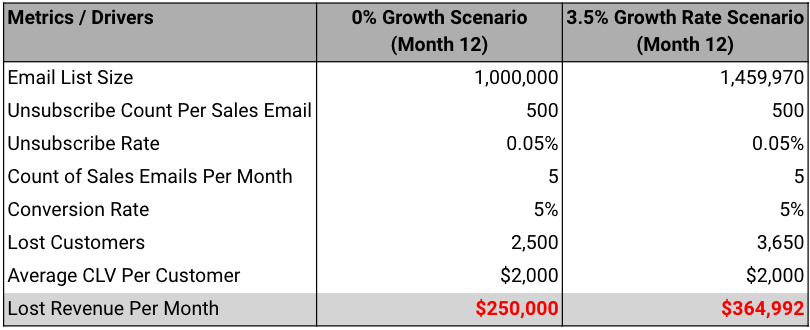
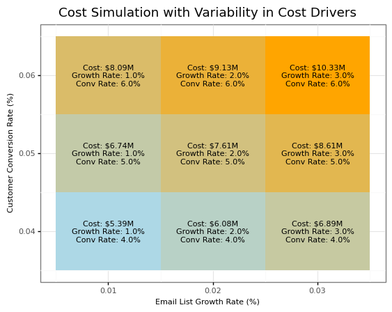
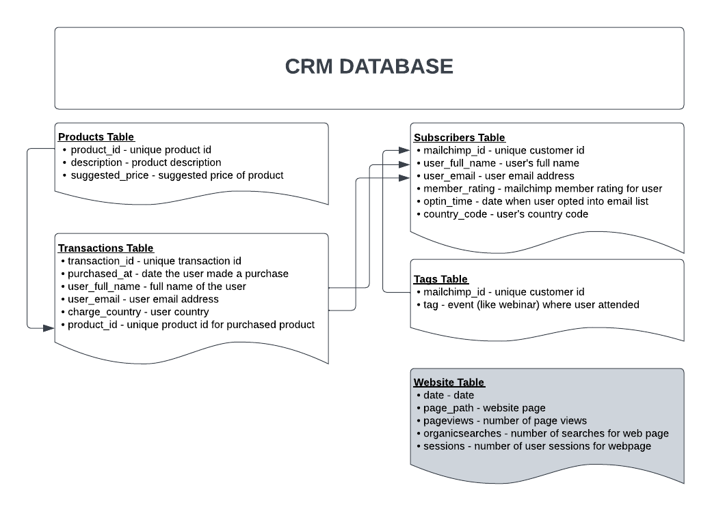
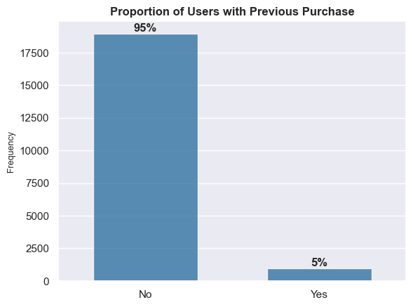
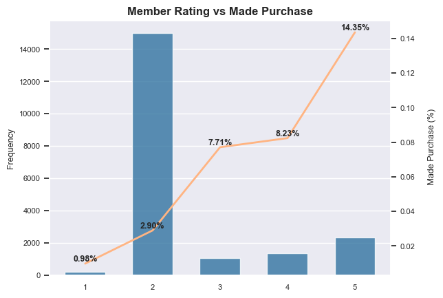
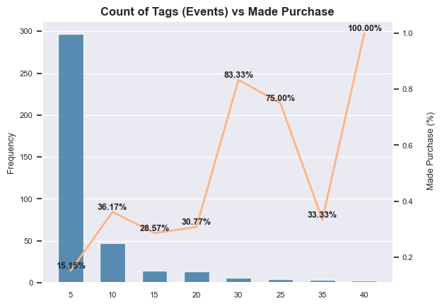
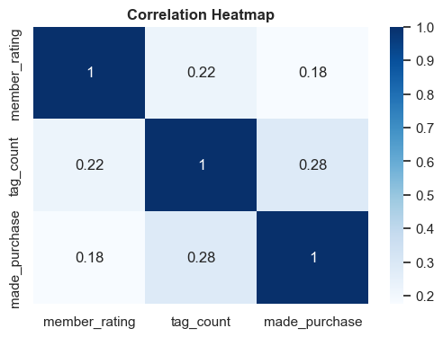

<!-- omit in toc -->

    <h1>Unleashing the Power of Machine Learning for Email Lead Scoring</h1>
    <h2>A Case Study & Guided Project Using the Business Science Problem Framework</h1>
    <h4>Lucas Okwudishu - June 2023</h1>

---

<!-- omit in toc -->
## Table of Contents

- [1.0 Introduction](#10-introduction)
- [2.0 Problem Statement \& Objective](#20-problem-statement--objective)
  - [2.1 Problem Statement](#21-problem-statement)
- [2.2 Objective](#22-objective)
- [3.0 Business Understanding](#30-business-understanding)
  - [3.1.0 Cost Assessment](#310-cost-assessment)
- [4.0 Data Understanding](#40-data-understanding)
  - [**4.1 Exploratory Data Analysis**](#41-exploratory-data-analysis)
    - [**4.1.1 Proportion of Users with a Previous Purchase**](#411-proportion-of-users-with-a-previous-purchase)
    - [**4.1.2 Member Rating vs Made Purchase**](#412-member-rating-vs-made-purchase)
    - [**4.1.3 Country Code vs Made Purchase**](#413-country-code-vs-made-purchase)
    - [**4.1.4 Tag Count vs Made Purchase**](#414-tag-count-vs-made-purchase)
    - [**1.4.5 Correlation**](#145-correlation)
- [**5.0 Formulating KPIs**](#50-formulating-kpis)

## 1.0 Introduction

Businesses face challenges in identifying and prioritizing potential customers and/or identifying future purchase potential of current customers based on their email interactions, leading to suboptimal allocation of resourcesa nd missed opportunities.

Email lead scoring plays a crucial role in determining the quality and conversion potential of leads generated through email marketing campaigns. Email lead scoring is a method
used by marketers and sales teams to evaluate and prioritize leads based on their potential to become customers. It involves assigning scores or ratings to individual leads
based on their behaviour, interations, and other characteristics. However, the traditional manual lead scoring methods are time-consuming, subjective, and often produce inconsistent results. Additionally, these methods do not fully leverage the available data, such as email content, sender information, and historical customer interactions.

Machine learning-based solution that can effectively evaluate the probability of leads converting into customers based on various data points extracted from email interactions. This solution should take into account factors like email open rates, click-through rates, response times, engagement patterns, and historical customer data to provide a comprehensive lead score.

By leveraging machine learning algorithms, such as classification models or predictive analytics techniques, businesses can create a reliable and automated system that can accurately score and rank email leads according to their conversion potential. The solution will empower email marketers to prioritize their efforts and resources more effectively, enabling them to focus on the most promising leads and improve overall sales and marketing efficiency.

This analysis works through and end-to-end email lead scoring solution for a business, from analysis to deployment. Skills demonstrated in this project include -

- Project management.
- Stakeholder management.
- Business understanding.
- Business return on investment and sensitivity analysis.
- Exploratory data analysis.
- Machine learning (using tools like python, pycaret, mlflow).
- Model deploying (using tools like fastapi and streamlit).

Above all, the project demonstrates how to solve key business problems in the real world.

## 2.0 Problem Statement & Objective

### 2.1 Problem Statement

As mentioned earlier, this analysis provides a lead scoring solution for a company (Business Science University). The company offers training cources in data science and has a large email list of **100,000** subscribers, with a monthly growth rate of **6,000** new subscribers. The marketing team also sends out **5** emails per month and the business's scales cycle generates approximately **$550,000** in revenue per month.

However, the email list also experiences a significant number of unsubscribes, about **500** per email, resulting in a total of **2,500** unsubscribers per month.

This High unsubscribe rate indicates potential inefficiencies in the email marketing strategy. In addition, high unsubscribe rates can result in reduced revenue especially if the business relies heavily on email marketing as a primary channel for generating leads and driving conversions. To sustain and increase revenue, it is crucial to optimize the email marketing approach and maximize customer conversion rates. The business also believes that nurturing lost customers has the potential to convert approximately 5% of them back into active customers.

---

## 2.2 Objective

Given these key insights, the problem at hand is to develop an effective email list scoring and segmentation strategy. The goal is to identify and prioritize the most valuable customers while reducing unsubscribe rates and increasing overall customer conversions. By segmenting the email list based on various factors and implementing tailored communication and nurturing strategies, the business aims to optimize the use of marketing resources and enhance revenue generation.

In summary, the primary objective is to leverage email list scoring and segmentation techniques to improve customer engagement, reduce unsubscribes, increase customer conversion rates, and ultimately maximize revenue and customer lifetime value.

Now that we have a general understanding of the problem statement and the objective, the next sections
will focus on a business solution process using the BSPF.

## 3.0 Business Understanding

We know that tackling business problems such as this requrires alot of resources including
time and money. Therefore a key question to ask is **is this problem worth solving?.**

In this phase, the key is to analyze if solving this problem should be a business prority. One way to achive this is by calculating the cost of the business problem by understand how high unsubscribe rates lead to lower revenue. Our goals in this phase include:

- Cost Assessment - Assign a cost to high unsubscribe rates, thus giving the business a point estimate of annual costs of unsubscribe rates. This step does NOT account of growth rate of email lists.
- Improve Cost Analysis - Improve on cost assesment by account for email list growth uncertainty.
- Business Cost Simulation - This is also necessary when accounting for uncertainty and helps model cost when key inputs change.

<!-- Page Break -->

#### 3.1.0 Cost Assessment

Given the values highlighted in the problem statement section, we can estimate the monthly lost revenue (we'll refer to this as **cost** going forward) due to unsubscribers to be around $250K per month (or $3M annually), not factoring in email list growth rate. After factoring in a 3.5% monthly email list growth rate, we can expect the annual lost revenue due to unsubscribers to rise to around $364K per month (or $4.3M per year), an increase of 46% in lost revenue. The table below shows this scenario.

    

We can see the high cost of this problem which is the lost revenue to the business. However, the
values shown in the table above do not factor in uncertainty. We can thus improve on
our cost assessment by factoring in uncertainty in some of the drivers. Let assume some monthly variablity in email list growth rate and conversion rate. The heatmap below shows a cost simulation with variablity. The *y* axis represents various levels of customer converstion rate while the *x* axis represents various levels of email list growth rate.

    

We can see that regardless of how the drivers vary, we can still expect to see annual costs ranging from $2.61M to $4.38M. Thus this is definitely a problem worth solving.

At this point, a key question is can we reduce the unsubscribe rate. Recall that the business is loosing
500 customers for every email sent out. What if we can reduce that number by 50% or 250.

## 4.0 Data Understanding

The next step is to understand the data available at our disposal to tackle this problem.
The visual below gives an overview of the companies crm database including table and table descriptions. Connecting arrows show how each table can be connecting to other tables based on common fields.

    

Note that we will not be using the website table for this analysis.

### **4.1 Exploratory Data Analysis**

After some initial data manipulation to get the data in the right format we need for analysis, including adding a *target* feature which is a binary flag of if a user has made a previous purchase or not (we'll call this target feature **made_purchase**), we can then begin to do some initial exploratory analysis to get a sense what features in our dataset could be predictive of users making a purchase.

First lets analyze our target feature *made_purchase*:

#### **4.1.1 Proportion of Users with a Previous Purchase**

    

**Observation:** Only 5% of users have made a previous purchase, meaning we are dealing with a highly imbalanced dataset.

#### **4.1.2 Member Rating vs Made Purchase**

The plot below shows the different values of *member_rating* vs the proportion of *made_purchase* for users with each value of *member_rating*:

    

**Observation:** Member rating appears to be quite predictive of *made_purchase*. We can see that the likelihood of a user making a purchase increases 3x when the *member_rating* goes from 1 to 2. Additionally the likelihood of making a purchase increases 5x when the *member_rating* goes from 2 to 5.

 

#### **4.1.3 Country Code vs Made Purchase**

The plot below shows *country_code* along with the within group *made_purchase* proportion, for the top 10 countries in terms of count of users.

**Observation:** Country code appears to be quite predictive of *made_purchase* as well.For example we can see that while the US has the most users (over 3,500), the proportion of US users who have made a purchase is ~10%. However a country like AU which has less than 500 users has a higher proprtion of users who have made a purchase (~12%).

 

#### **4.1.4 Tag Count vs Made Purchase**

The plot below shows *tag_count* along with the within group *made_purchase* proportion, for a selected number of *tag_count*. Recall that tags here refer to various events like trainings and webinars. Therefore *tag_count* refers to the number of such events a user has attended:

    

**Observation:** We can see that if a user has 40 or more tags (events), they are 100% likely to make a purchase. That likelihood drops as *tag_count* decreases. Note that a users with 0 tags only have a 2% likelihood of making a purchase. For these users (with 0 tags) we may not want to send them emails just yet. We may want to try and nurture them to attend more events before trying to get them to make a purchase. Overall if the business can get users to attend more events, it drastically increases their likelihood of making a purchase.

 

#### **1.4.5 Correlation**

The plot below is a correlation heatmap of numberic features only. These correlation values further validatates some of the data we saw earlier. We can see that *tag_count* and *member_rating* do show a fairly high correlation with *made_purchase*.

    

 

## **5.0 Formulating KPIs**

Now that we have a bit more understanding of some of the potential drivers of *made_purchase*, we may want to develop some hypothesis about how to improve the likelihood of a user making a purchase by applying some of the insights we just learned. For example:

- Can we reduce the number of sales emails sent to users by 30% and still maintain 99% of sales revenue.

- Can we segment our email list into **hot** and **cold** leads. Hot leads meaning users
who are more likely to purchase (users with high *member_rating* for example), and cold leads meaning user less likely to purchase (users with low *member_rating*). This way we could come up with a strategy to only send sales emails to hot leads, while nuturing cold leads to increase their likelihood of purchase.

One of such KPIs could be to increase the median *tag_count*. Looking at the table below, we can see that the median *tag_count* for users who have not made a purchase is 0 while for those who have made a purchase, the median *tag_count* is 2. Thus we could establsh a KPI for cold leads to get their median tag count to 2 or more (attend 2 or more webinars/events) and increase their likelihood of making a purchase.

    

 
